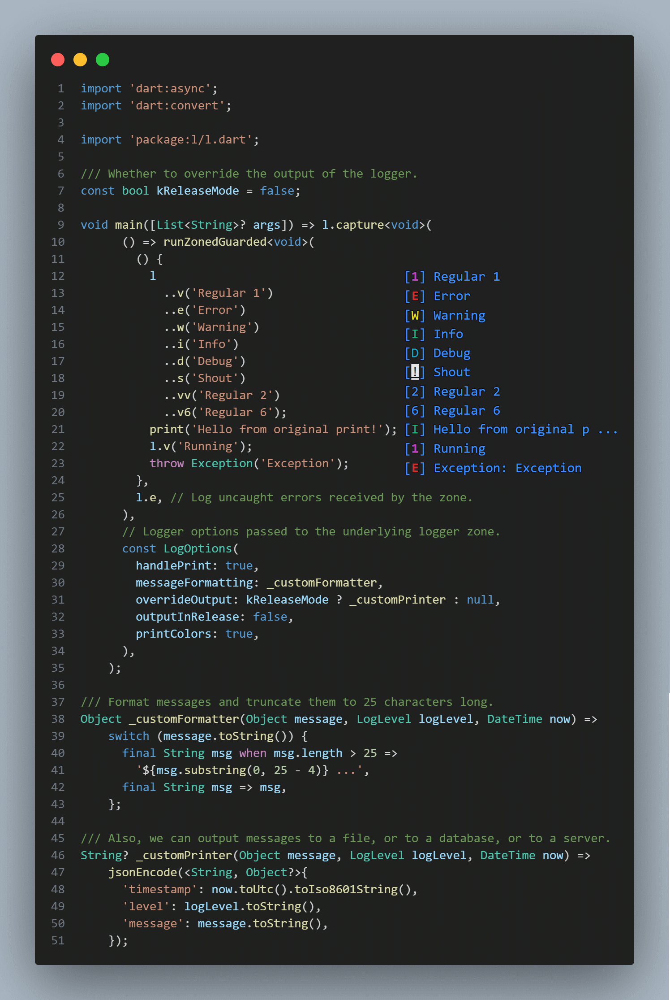

# [L]ogger

<!--  -->

[](https://pub.dev/packages/l)
[](https://github.com/PlugFox/l/actions)
[](https://codecov.io/gh/PlugFox/l)
[](https://opensource.org/licenses/MIT)
[](https://pub.dev/packages/linter)
[](https://github.com/plugfox/l/)

## About

Cross-platform html/io logger with simple API.
No need to create a logger object. Just import and use. Simple and w/o boilerplate.
Work with native console.

## Core API

### Example of usage


[Example of using the library](https://pub.dev/packages/l/example) to display a message in the console.

### Key features

| Method         | Description                          |
| -------------- | ------------------------------------ |
| [s]            | A shout is always displayed          |
| [v1], [v]      | Regular message with verbose level 1 |
| [e]            | Error message with verbose level 1   |
| [v2], [vv]     | Regular message with verbose level 2 |
| [w]            | Warning message with verbose level 2 |
| [v3], [vvv]    | Regular message with verbose level 3 |
| [i], [<]       | Inform message with verbose level 3  |
| [v4], [vvvv]   | Regular message with verbose level 4 |
| [d], [<<]      | Debug message with verbose level 4   |
| [v5], [vvvvv]  | Regular message with verbose level 5 |
| [v6], [vvvvvv] | Regular message with verbose level 6 |

```dart
l.s('shout me');
l.e('error msg');
l.w('warning msg');
l.i('info msg');
l < 'alt info msg';
l.d('debug msg');
l << 'alt debug msg';
l.v('verbose lvl #1');
l.vv('verbose lvl #2');
l.vvv('verbose lvl #3');
l.v4('verbose lvl #4');
l.v5('verbose lvl #5');
l.v6('verbose lvl #6');
```

### Integration capabilities

| Method   | Description                      |
| -------- | -------------------------------- |
| [listen] | Broadcast stream receiving logs. |

```dart
// Broadcast stream instantly receiving logs.
l.forEach((log) => print('* ${log.level} : ${log.message}'));
```

### Print handling and customizing

Logger supports fine-tuning with the second argument ` LogOptions` in a `capture` method.
Also, you can handle `print` and output with `l` on some function or in a whole app with this simple syntax:

```dart
import 'package:l/l.dart';

void main() => l.capture(
      someFunction,
      const LogOptions(
        handlePrint: true,
        printColors: true,
        outputInRelease: false,
        messageFormatting: _messageFormatting,
      ),
    );

Future<void> someFunction() async {
  print('Hello');
  await Future<void>.delayed(const Duration(milliseconds: 150));
  l.d('world');
  await Future<void>.delayed(const Duration(milliseconds: 150));
  l.e('!!!');
}

Object _messageFormatting(Object message, LogLevel logLevel, DateTime now) =>
    '${now.hour}:${now.minute.toString().padLeft(2, '0')} $message';
```

## Handling errors

### Flutter

```dart
final sourceFlutterError = FlutterError.onError;
FlutterError.onError = (details) {
  l.w(details.exceptionAsString(), details.stack);
  sourceFlutterError?.call(details);
};
```

### Crashlytics

```dart
l.where((msg) => msg.level.maybeWhen(
      error: () => true,
      warning: () => true,
      orElse: () => false,
    ))
  .map<String>((msg) => msg.message.toString())
  .listen(FirebaseCrashlytics.instance.log);
```

### Zoned Errors

```dart
runZonedGuarded(someFunction, l.e);
```

### Handling uncaught errors

```dart
Isolate.current
       ..setErrorsFatal(false)
       ..addErrorListener(
         RawReceivePort(
           (List<dynamic> pair) => // ignore: avoid_types_on_closure_parameters
               l.e(pair.first as Object),
         ).sendPort,
       );
```

## Limitations

- When there is no direct access to the terminal, it works through print.
- **!!! PLEASE, DO NOT LOG SENSITIVE INFORMATION !!!**

## Changelog

Refer to the [Changelog](https://github.com/plugfox/l/blob/master/CHANGELOG.md) to get all release notes.

## Maintainers

[Plague Fox](https://plugfox.dev)

## Funding

If you want to support the development of our library, there are several ways you can do it:

- [Buy me a coffee](https://www.buymeacoffee.com/plugfox)
- [Support on Patreon](https://www.patreon.com/plugfox)
- [Subscribe through Boosty](https://boosty.to/plugfox)

We appreciate any form of support, whether it's a financial donation or just a star on GitHub. It helps us to continue developing and improving our library. Thank you for your support!

## License

[MIT](https://opensource.org/licenses/MIT)
